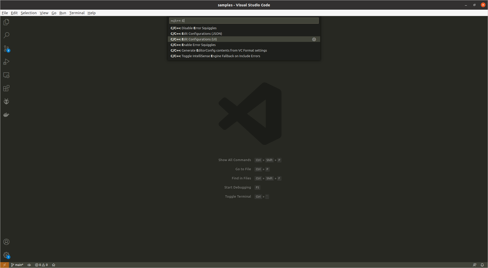
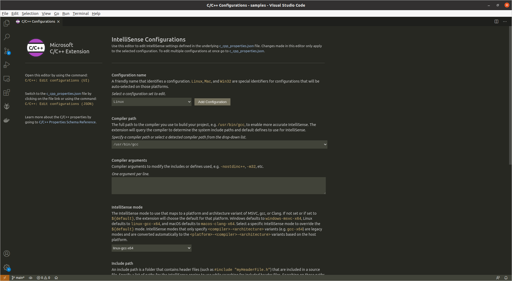

C언어가 무엇이고 왜 공부할까
===

프로그래밍
---

컴퓨터나 스마트폰은 다른 전자기기와 달리 하나의 일만 하는 게 아니라 어떤 프로그램을 실행하냐에 따라 다른 일을 하는 범용적인 기계입니다.    
그리고 이러한 범용적인 기계에서 작동하는 프로그램을 만드는 일을 프로그래밍이라고 하죠.    
프로그램은 일련의 명령어로 이루어져 있으며 결국 프로그래밍이란 일련의 명령어를 작성하는 과정이라고 할 수 있습니다.    

컴퓨터는 기본적으로 0과 1로 이루어진 **기계어 _machine language_** 밖에 알아듣지 못하는데, 인간은 이러한 기계어를 이해하기 어렵습니다.    
숫자 하나만 빼먹거나 잘못 써도 완전히 다른 의미가 될 수 있는데 그것을 찾아내기도 어렵죠.    
따라서 인간이 이해할 수 있는 언어로 작성하여 기계어로 번역한 뒤 컴퓨터는 번역된 코드를 실행합니다.    
이 때, 인간이 이해할 수 있는 언어를 기계어로 번역하는 과정을 **컴파일 _compile_** 이라고 하죠.    
그런데 인간이 일상적으로 사용하는 한국어, 영어와 같은 **자연어 _natural language_** 는 너무 광범위하고 애매한 표현이 많아 기계어로 바로 번역할 수 없습니다.    
그래서 인간이 이해할 수 있으면서도 기계어로 컴파일 가능한 "기계어와 자연어 사이의 타협점"으로서 **프로그래밍 언어 _programming language_** 가 개발되었습니다.

세상에는 참 다양한 프로그래밍 언어가 존재합니다.    
그리고 그들은 각각의 장단점이 있으며, 무엇을 할 것인가에 따라 가장 적절한 언어가 무엇인지도 달라집니다.    
안드로이드 앱 개발을 할 땐 Kotlin이 적절하고, 아이폰 앱 개발을 할 땐 Swift가 적절하며, 인공지능 모델을 개발할 땐 Python이 적적절한 것과 같이 말이죠.    
물론 Java로 안드로이드 앱 개발을 할 수도 있고 C++로 인공지능 모델을 만들 수도 있는 등 언어와 용도가 1 대 1 매핑 되는 것은 아닙니다.    
서로 다른 언어가 같은 용도로 자주 사용되기도 하고, 하나의 언어가 서로 다른 용도로 사용되기도 합니다.    
아무튼 그 다양한 언어 중 **C언어**에 대한 이야기를 하고자 합니다.

C언어? 그게 뭐죠?
---

C언어는 Dennis Ritchie에 의하여 만들어진... 같은 진부한 이야기는 패스합시다.    
UNIX 운영체제를 개발하기 위해 만들어진 언어다 뭐다 하는 것은 여기서 이야기하는 것보다는 [위키백과](https://ko.wikipedia.org/wiki/C_(프로그래밍_언어)) 같은 곳에서 읽어보는 게 더 효율적이겠죠.    

C언어는 다른 언어들에 비해 크기가 작으며 실행 속도가 빠르고 메모리를 효과적으로 사용하는 프로그램을 작성할 수 있습니다.    
~~사실 좀 더 깊게 들어가면 본질적인 메모리 이슈가 있긴 하지만, 이 자리는 Rust를 영업하는 자리가 아니라 C언어를 공부하는 자리이므로 그것에 대한 이야기는 패스합니다. 기회가 되면 Rust도 배워보세요?~~    
그리고 하드웨어 수준의 제어가 가능하므로 운영체제 내부의 커널 영역이나 임베디드 시스템을 구현할 때 유용하게 사용됩니다.    
또한 많은 프로그래밍 언어가 C언어에서 파생되었으므로 C 프로그래밍을 할 계획이 아니더라도 C언어를 익힘으로써 다른 언어들을 보다 쉽게 배울 수 있죠.

메모리 관리를 자동으로 해주어 메모리 누수에 대한 걱정을 하지 않아도 되는 언어들에 비해 이를 신경써야 한다는 점에서 초보자들이 배우기 어렵다는 관점도 있긴 하지만, 메모리와 효율성, 안전성 등에 대한 인식도 꽤나 중요한 영역이라고 생각하기에 C언어를 배우며 그 부분들에 대해서도 함께 공부하는 것은 유의미한 학습이라는 것이 제 입장입니다.

C언어는 대표적인 **절차지향 _procedural_** 프로그래밍 언어입니다.    
이는 객체 사이의 상호작용을 기반으로 프로그램을 작성하는 **객체지향 _object-oriented_** 과는 대비되는 개념으로, 프로그램의 시작 지점으로부터 순차적으로 실행되어가는 일련의 선형적인 절차를 기반으로 프로그램을 작성하는 방식입니다.    
C언어는 `main` 이라고 불리는 특별한 함수의 시작부분에서 시작하여 그 함수의 내용을 위에서부터 순서대로 실행하죠.

프로그램을 작성한다는 것
---

프로그램은 크게 **자료구조 _data structure_** 와 **알고리즘 _algorithm_** 으로 구성된다고 볼 수 있습니다.    
자료구조는 프로그램 실행에 필요한 데이터를 어떻게 관리할 것인지 결정하며 알고리즘은 프로그램이 어떻게 실행될 것인지 결정합니다.    
프로그래밍 언어의 기본 문법을 익힌 후에는 이들에 대한 보다 집중적인 학습을 하도록 하고 언어 문법 그 자체에 집중합시다.    
물론 그럼에도 불구하고 최소한의 자료구조와 알고리즘은 포함되겠지만, 초급반 수준에서는 그것들에 대해 따로 공부하지 않아도 무리 없는 수준의 코드를 사용합니다.    

프로그램은 일반적으로 다음과 같은 과정으로 개발합니다.

1. **요구 사항 분석**    
어떤 프로그램을 개발할지 프로그램을 사용할 사용자들의 요구 사항을 구체적으로 파악한다.    
2. **알고리즘 개발 (설계)**    
어떤 순서로 어떻게 작업을 처리할지 과정과 방법을 설계한다.    
의사코드, 순서도, UML 등을 사용하여 표현할 수 있다.    
3. **소스 코드 작성 (구현)**    
흔히 코딩이라고 불리는 과정으로, 설계된 알고리즘을 프로그래밍 언어를 통해 작성한다.    
이 때, 어떤 프로그래밍 언어를 사용할 것인지 결정하는 것도 중요하며, 분석 및 설계한대로 구현해야 한다.    
4. **컴파일과 링크 (빌드)**    
프로그래밍 언어로 작성된 소스 코드를 컴퓨터가 이해할 수 있는 언어로 번역하는 컴파일 과정을 거치면 오브젝트 파일이 생성되며, 이 오브젝트 파일을 외부 라이브러리와 링크하여 실행 프로그램을 만든다.    
이 때, 오류가 발생하면 컴파일을 멈추고 어떤 오류가 발생하였는지 알린다.    
이러한 오류를 **컴파일 오류 _compile error_** 라고 한다.    
오류 메시지와 오류 발생 위치를 보고 어떤 문제가 있는지 파악하여 소스 코드 작성 단계로 돌아가 수정 후 다시 컴파일을 해야 한다.    
빌드 과정이 컴파일과 링크로 나뉘어 있는 것은 소스 코드의 일부만 수정되었을 때 프로젝트 전체를 다시 컴파일하기 보다는 수정된 파일만 다시 컴파일하기 위함이다.    
5. **실행과 디버깅 (검증)**    
때로는 컴파일 과정에서는 오류가 발생하지 않았지만 의도치 않은 방식으로 구현될 수도 있다.    
이런 경우에 대비하여 프로그램을 실행해보고 이를 수정해야 한다.    
컴파일은 문제 없이 잘 되었으나 의도하지 않은 방식으로 작동하는 것을 **논리 오류 _logical error_** 라고 한다.    
프로그램에 존재하는 오류는 **버그 _bug_** 라고도 하며, 그 오류를 해결하는 과정을 **디버깅 _debugging_** 이라고 한다.    
버그를 찾아내고 수정하며 요구사항에 맞는지 검증하기 위해 잘 작동하는지 테스트를 통해 확인하기도 한다.    
6. **유지 보수**    
프로그램 개발을 완료하여 출시한 후에도 버그가 남아있거나 다른 요구 사항이 추가될 수 있다.    
이러한 경우에 이를 프로그램에 추가적으로 반영하는 작업이 필요하다.    
연습용 프로그램을 작성할 때는 고려하지 않아도 되지만, 업계에서는 개발 비용 중 유지 보수 비용이 차지하는 비율이 상당하다.    

C언어 개발 환경 구축하기
---

프로그램 개발을 하기 위해서는 이를 위한 개발 환경을 구축해야 합니다.    
개발 환경에는 소스 코드를 작성하기 위하 편집기, 실행 가능한 형태로 번역하기 위한 컴파일러, 그리고 어디서 어떤 버그가 발생했는지 추적하기 위한 디버거 등이 포함됩니다.    
이것들은 각각 설치하여 사용할 수도 있고, 하나의 도구에 이들이 모두 포함되어 있는 **통합 개발 환경 _IDE: Integrated Development Environment_** 을 사용할 수도 있습니다.    

통합 개발 환경은 그것 하나만 설치하면 된다는 간편함이 있는 반면, 어떤 사용자에게는 필요하지 않은 기능까지 다양하게 제공하면서 필요에 비해 큰 용량을 차지할 수 있다는 단점이 있습니다.    
C언어를 사용하기 위한 대표적인 통합 개발 환경으로는 Visual Studio, Code::Blocks, Dev-C++ 등이 있죠.    

흔히 학교에서 C언어를 다루는 수업을 들으면 학생들의 실습 환경이 Windows일 것이라고 가정하며 Visual Studio를 사용하는 경우가 많습니다만, ~~최신 버전은 많이 개서되었다지만~~ Visual Studio는 비표준 문법이 많아서 솔직히 비추입니다.    
C언어 문법 상 전혀 문제되지 않지만 Visual Studio를 사용하는 경우에만 문제되는 것도 있고, 다른 C언어 컴파일러와는 호환되지 않는 Visual Studio 독자적인 함수도 있고... 아무튼 그렇습니다.    

따라서, 이 교육 프로그램에서는 통합 개발 환경을 따로 사용하지 않고 Visual Studio Code + GCC (Windows의 경우 MinGW)를 사용하도록 하겠습니다.    
Visual Studio Code(이하 VSC)는 Visual Studio와는 다른! 프로그램으로, 통합 개발 환경이 아닌 편집기입니다.    
일반적인 편집기와 달리 여러 가지 확장 플러그인을 설치하기 쉬워서 많이 사용되죠.    

[VSC 다운로드 페이지](https://code.visualstudio.com/download)에서 자신의 운영체제에 맞게 내려 받아 설치하도록 합니다.    

컴파일러는 운영체제에 따라 차이가 있습니다만, Linux 또는 Mac을 사용하는 경우 GCC를 사용하도록 하겠습니다.    
clang 등의 다른 선호하시는 컴파일러가 있다면 다른 컴파일러를 사용하셔도 무방합니다.    

Debian 계열의 Linux에서는

```bash
$ sudo apt install gcc
```

Redhat 계열의 Linux에서는

```bash
$ sudo yum install gcc
```

Mac에서는

```bash
$ brew install gcc
```

로 설치하실 수 있습니다.    
~~XCode 명령줄 도구가 설치되어 있는 Mac이라면 GCC가 이미 설치되어 있을 거라는 건 여담~~

간단한 명령어 한 줄로 설치가 되는 Linux, Mac과 달리 Windows는 [MinGW](https://sourceforge.net/projects/mingw-w64/files/mingw-w64)를 내려 받아 여기서 GCC를 설치해야 합니다.    
[설치 링크](https://sourceforge.net/projects/mingw-w64/files/Toolchains%20targetting%20Win32/Personal%20Builds/mingw-builds/installer/mingw-w64-install.exe/download)로 접속하여 잠시 기다리면 자동으로 설치 파일이 다운로드 될 것이며, 설치 프로그램이 시키는대로(?) 따라 설치하면 됩니다.    
setup 설정에서 Architecture는 본인 PC에 맞게 선택하고, Threads는 `posix`, Exception은 `seh` 를 선택합니다.    
조금 귀찮은 작업이긴 하지만 Windows 사용자라면 이 작업에 익숙하시리라 믿으며... 자세한 설명은 생략합니다?    
~~사실 제가 이 작업에 안익숙합니ㄷ...;; 저도 Windows에서 환경 구축 안해봤습ㄴ...~~

MinGW 설치가 완료되었으면 환경 변수 `PATH` 에 설치 경로를 등록합니다.    
설치 경로는 대략 `C:\Program Files\mingw-w64\x86_64-8.1.0-posix-seh-rt_v6-rev0\mingw64\bin` 비슷한 경로일 겁니다.    
_제어판 > 시스템 > 고급 시스템 설정 > 고급 > 환경 변수_ 에서 변수 `Path` 에 _편집_ 버튼을 누르고 _새로 만들기_ 버튼을 통해 추가할 수 있다는 군요?    
~~항상 느끼는 거지만 GUI로 설정할 땐 찾아 들어가는 게 일인 것 같습니다;;;~~

모든 운영체제 공통으로 여기까지 했으면 터미널 혹은 cmd 창에서 다음 명령어로 GCC가 잘 설치되어 있는지 확인하실 수 있습니다.    

```bash
$ gcc --version
```

정상적으로 설치되었다면 GCC 버전 정보가 출력될 것입니다.

GCC 설치를 마쳤으면 다시 VSC로 돌아와  좌측 메뉴의 확장 플러그인 설치 메뉴를 누르거나 `ctrl + shift + x` 를 누른 뒤 `C/C++` 를 검색하여 이를 설치합니다.    
이것 없이도 C 언어 프로그래밍을 하는 데 문제가 되지는 않지만 설치해두는 편이 유용합니다.    

좌측 메뉴의 탐색 메뉴를 누르거나 `ctrl + shift + e` 를 누른 후 _Open Forder_ 버튼을 통해 실습을 진행할 디렉토리를 선택합니다.    
이 교육 프로그램 저장소를 clone한 곳에 하위 디렉토리로 실습 디렉토리를 만들면 과제 제출에 용이하겠죠?

상단 메뉴바의 `View > Command Palette...` 버튼을 누르거나 `ctrl + shift + p` 를 눌러 커멘드 파레트를 열고, 다음과 같은 명령어를 실행합니다.

```
> C/C++: Edit Configurations (UI)
```



그러면 다음과 같은 설정 화면을 확인할 수 있는데,



_Compiler Path_ 를 드롭다운 메뉴를 통해 (운영체제에 따라) `bin/usr/gcc` 또는 `C:/.../gcc.exe` 로 GCC 설치 경로를 선택합니다.    
그리고 _IntelliSense mode_ 는 (운영체제에 따라) `linux-gcc-x64` 또는 `macos-gcc-x64` 또는 `windows-gcc-x64` 를 선택합니다.    
이미 그렇게 설정되어 있다면 아무것도 건드리지 않아도 되지만 말이죠.

자 그러면 간단한 프로그램을 작성해봅시다.    
좌측 메뉴의 탐색 메뉴를 누르거나 `ctrl + shift + e` 를 누른 후 _New Folder_ 버튼을 통해 `chapter01` 이라는 이름의 디렉토리를 생성합니다.    
그리고 _New File_ 버튼을 통해 그 안에 `hello.c` 라는 이름의 파일을 생성합니다.    
VSC는 이 파일의 확장자가 `.c` 인 것을 보고 이것이 C 언어 소스 파일임을 인식하고 파일 이름 옆에 이것이 C 언어 소스 파일임을 나타내며, C언어 문법에 맞게 소스 코드에 하이라이팅 색상을 넣어줍니다.    

코드를 작성해볼까요?    
당장은 코드의 의미를 해석할 필요 없이 일단 따라 적어봅시다.

```c
#include <stdio.h>

void main() {
    printf("Hello, KCA!\n");
}
```

작성 후 `ctrl + s` 를 통해 저장한 뒤 상단 메뉴의 _Terminal > New Terminal_ 을 누르거나 ctrl + shift + ` 를 누르면 하단에 터미널이 열립니다.    
터미널에서 다음과 같이 입력합니다.    
~~$는 터미널 줄의 시작을 알리는 프롬프트이므로 이건 입력하지 않습니다.~~

```bash
$ cd chapter01
chapter01$ gcc hello.c -o hello
chapter01$ ./hello
```

아 Windows의 경우 파일 이름을 `hello` 가 아니라 `hello.exe` 처럼 `.exe` 확장자를 붙이는 게 일반적이라고는 합니다.    

`cd` 명령어는 그 뒤에 오는 이름의 디렉토리로 현재 디렉토리를 이동하는 명령어입니다.    
이걸 통해 아까 생성한 `chapter01` 디렉토리로 들어와 `gcc` 명령어로 컴파일 합니다.
컴파일 명령어 형식은 다음과 같습니다.

```bash
$ gcc <C 파일 이름> -o <실행 파일 이름>
```

혹은 `-o` 플래그를 먼저 적어

```bash
$ gcc -o <실행 파일 이름> <C 파일 이름>
```

그리고 실행을 위해서는 실행 파일 이름을 입력하면 되는데, 시스템에 내장되어 있는 명령어와 겹칠 경우 의도치 않은 실행 파일이 실행될 수 있어 현재 디렉토리에 있는 파일이라는 의미에서 파일 이름 앞에 `./` 를 붙이는 게 일반적입니다.    

정상적으로 실행되었다면 다음과 같이 출력되는 것을 확인할 수 있습니다.

```
Hello, KCA!
```

과제
---

자, 이걸로 C언어 프로그래밍을 위한 준비를 마쳤습니다.    
오늘의 과제는 아주 간단합니다.    
실습 환경 구축을 마친 후 `hello.c` 파일을 작성 및 컴파일하여 실행 화면을 캡처하고 C 소스 파일, 실행 파일, 스크린샷 이미지 파일을 git 저장소에 올려 PR을 보내주시면 됩니다.    

본인 이름 혹은 식별할 수 있는 문자열로 된 디렉토리를 생성하고 그 하위 디렉토리로 `chapter01` 을 만들어 그 안에 파일들을 넣어주세요.    
과제를 성공적으로 완료하였다고 판단되면 merge 해드리며, 그렇지 않을 경우 comment로 피드백 드리겠습니다.    
