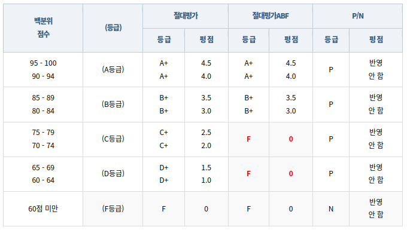

조건에 따라 실행하기
===

기본적으로 프로그램은 위에서부터 아래로 차례대로 실행됩니다.    
그런데 만약 이와 같이 순차적으로만 실행된다면 프로그램의 기능에는 한계가 있을 것입니다.    
따라서 어떤 조건에 따라 실행 여부를 결정하거나 특정 횟수만큼 또는 특정 조건 하에 반복하는 코드를 작성하여 프로그램의 흐름을 변경하곤 하죠.    
이번 시간에는 그 중 조건에 따라 실행 여부를 결정하는 방법에 대해 알아보도록 하겠습니다.

`if` 와 `else`
---

어떤 코드를 특정 조건이 참인 경우에만 실행하고자 한다면 `if` 키워드를 사용합니다.    

```c
if (조건)
    실행할 코드;
```

이러한 코드를 조건문, 그 중에서도 `if` 키워드를 사용한 조건문이라고 해서 `if` 문이라고 합니다.    
실행할 코드가 여러 줄일 경우에는 다음과 같이 중괄호로 묶어 줍니다.

```c
if (조건) {
    실행할 코드;
    실행할 코드;
}
```

실행할 코드가 한 줄인 경우에도 가독성을 위해 중괄호로 묶어 주기도 합니다.     
한 줄짜리 코드에 대해서 중괄호를 묶어 줄지 여부는 선택적이지만, 이 교육 프로그램 자료에서는 중괄호를 묶어 주도록 하겠습니다.

조건문의 조건에는 수식이 들어가는데, 주로 참(`1`)과 거짓(`0`)으로 값이 결정되는 수식이 사용됩니다.    
관계 연산이나 논리 연산처럼 말이죠.

둘 이상의 조건을 모두 만족하거나 혹은 그 중 하나라도 만족하면 실행시키고 싶은 코드가 있다면 논리 연산을 통해 여러 개의 조건을 설정할 수 있죠.

```c
if (조건1 && 조건2) {
    두 조건을 모두 만족할 때 실행할 코드;
}
```

```c
if (조건1 || 조건2) {
    두 조건 중 하나라도 만족할 때 실행할 코드;
}
```

때로는 특정 조건을 만족하면 어떤 코드를, 만족하지 않으면 다른 코드를 실행하고 싶을 때가 있습니다.    
이 땐 `else` 키워드를 사용한 `else` 문을 통해 이를 작성할 수 있습니다.    
`else` 문은 반드시 `if` 문과 함께 사용해야 하며, `if` 문의 조건에 따라 실행되므로 따로 조건을 갖고 있지 않습니다.

```c
if (조건) {
    조건이 참이라면 실행할 코드;
} else {
    조건이 거짓이라면 실행할 코드;
}
```

경우에 따라서는 조건문 내부에 또 조건문이 들어갈 수도 있습니다.    

```c
if (조건1) {
    조건1이 참이라면 실행할 코드;
    if (조건2) {
        조건1과 조건2가 모두 참이라면 실행할 코드;
    } else {
        조건1은 참이지만 조건2는 거짓이라면 실행할 코드;
    }
} else {
    조건1이 거짓이라면 실행할 코드;
    if (조건3) {
        조건1은 거짓이지만 조건3은 참이라면 실행할 코드;
    } else {
        조건1과 조건3이 모두 거짓이라면 실행할 코드;
    }
}
```

하지만 조건이 많이 중첩되고 들여쓰기가 많아질수록 가독성이 떨어질 수 있음을 유의합시다.

특정 조건이 거짓일 때 다른 조건을 추가적으로 검사하고자 한다면 `else` 문에 조건문을 추가하는 방법도 있지만, 조건문을 여러 개 중첩하는 것보다 다음과 같이 `else if` 문을 사용하는 편이 좋습니다.

```c
if (조건1) {
    조건1이 참이라면 실행할 코드;
} else if (조건2) {
    조건1은 거짓이며 조건2가 참이라면 실행할 코드;
} else {
    전부 거짓일 경우 실행할 코드;
}
```

`else if` 문의 조건은 그 앞에 연결된 모든 `if` 문 혹은 `else if` 문의 조건이 거짓인 경우에만 확인합니다.    
예를 들어 위 코드에서는 `조건1` 이 참인 경우 `조건2` 를 검사하지 않으며, `조건1` 이 거짓인 경우엠나 `조건2` 에 대한 검사로 넘어갑니다.    

`if` 와 `else` 는 특정 조건을 만족하는지 여부에 따라 판단한다는 점에서 조건 연산자 `?` `:` 와 유사한 측면이 있습니다.     
조건과 실행 코드가 동일하다면 실행 코드가 짧을 경우엔 조건 연산이 더 간결하기도 하지만, 조건문이 복잡해질수록 조건 연산으로 작성하면 가독성이 떨어질 수 있기에 때로는 `if` 문을 사용하는 게 나을 수 있습니다.    
속도 측면에서는 큰 차이 없지만 실행 코드가 짧을 땐 조건 연산자가 더 빠르다는 말이 있더군요?


`switch`
---

만약 "이 수식의 값이 □인가?"라는 조건으로 `if` - `else if` - `else` 가 이어진다면, `if` 문을 사용하는 것보다 `switch` 문을 사용하는 게 나을 수 있습니다.    

`switch` 문은 어떤 수식에 대하여 그 값이 특정 값과 같을 때에 어떤 코드를 실행하고자 하는 경우에 사용합니다.    
이 때, 수식과 비교되는 값ㅇ느 반드시 상수여야 합니다.    
~~언어에 따라서는 그렇지 않은 경우도 있지만, C언어에서는 상수여야 합니다.~~

```c
switch (수식) {
    case 상수값1:
        수식의 값이 상수값1과 같을 때 실행할 코드;
        break;
    case 상수값2:
        수식의 값이 상수값2과 같을 때 실행할 코드;
        break;
    case 상수값3:
        수식의 값이 상수값3과 같을 때 실행할 코드;
}
```

위 `switch` 문은 아래 `if` 문과 동일하게 작용합니다.

```c
if (수식 == 상수값1) {
    수식의 값이 상수값1과 같을 때 실행할 코드;
} else if (수식 == 상수값2) {
    수식의 값이 상수값2과 같을 때 실행할 코드;
} else if (수식 == 상수값3) {
    수식의 값이 상수값3과 같을 때 실행할 코드;
}
```

주목할 점은, 각각의 `case` 문 사이에 `break;` 가 있다는 것입니다.    
수식의 값이 어떤 상수값과 같을 때 해당 `case` 문으로 이동하는데, `break;` 가 없다면 해당 `case` 문의 범위가 끝나도 `switch` 문 밖으로 나가지 않고 다음 `case` 의 코드를 계속 이어서 실행합니다.    
따라서 의도적으로 다음 코드까지 실행하고자 하는 경우가 아니라면 `break;` 를 빼먹지 않도록 합시다.

수식의 값과 일치하는 상수값의 `case` 가 존재하지 않는다면 아무것도 실행되지 않은 채 `switch` 문을 벗어납니다.    
만약 일치하는 상수값이 없는 예외적인 경우에 따로 실행하고자 하는 코드가 있다면 모든 `case` 문을 다 작성한 후, 맨 아래에 `default` 문을 작성할 수 있습니다.

```c
switch (수식) {
    case 상수값1:
        수식의 값이 상수값1과 같을 때 실행할 코드;
        break;
    case 상수값2:
        수식의 값이 상수값2과 같을 때 실행할 코드;
        break;
    case 상수값3:
        수식의 값이 상수값3과 같을 때 실행할 코드;
        break;
    default:
        수식의 값이 그 무엇과도 같지 않을 때 실행할 코드;
}
```

실습
---

`if` 와 `else` 를 사용하는 조건문 예제를 몇 가지 살펴 보겠습니다.

### 실습1:

다음은 윤년과 평년에 대한 조건입니다.

- 서력기원으로 연수가 4로 나누어 떨어지는 해는 윤년으로 한다.    
(2004년, 2008년, 2012년, 2016년, 2020년…)    
- 이 중에서 100으로 나누어 떨어지는 해는 평년으로 한다.    
(1900년, 2100년, 2200년, 2300년…)    
- 그중에 400으로 나누어 떨어지는 해는 윤년으로 둔다.    
(1600년, 2000년, 2400년 …)

이 조건에 따르면 연도 `year` 에 대하여 `year % 400 == 0` 인 경우 항상 윤년입니다.    
그리고 남은 해 중 `year % 100 == 0` 인 경우는 평년이고, 또 남은 해 중 `year % 4 == 0` 인 경우도 윤년이며, 그 외의 모든 해는 평년이죠.    

이를 있는 그대로 C 코드로 작성하면,

```c
#include <stdio.h>

int main(void) {
    int year;
    printf("연도 입력: ");
    scanf("%d", &year);

    int isLeap;
    if (year % 400 == 0) {
        isLeap = 1;
    } else if (year % 100 == 0) {
        isLeap = 0;
    } else if (year % 4 == 0) {
        isLeap = 1;
    } else {
        isLeap = 0;
    }

    if (isLeap) {
        printf("%d년은 윤년입니다.\n", year);
    } else {
        printf("%d년은 평년입니다.\n", year);
    }

    return 0;
}
```

400, 100, 4 순서로 가는 건, 100의 배수인 4의 배수까지 다 윤년 취급하거나, 400의 배수가 아닌 100의 배수까지 다 평년 취급하는 것을 방지하기 위함입니다.    

그런데 윤년의 조건을       
1. 400으로 나누어 떨어지는 경우 또는,
2. 100으로 나누어 떨어지지 않으며 4로 나누어 떨어지는 경우    

라는 관점으로 다시 생각하면, 코드를 다음과 같이 축약할 수 있습니다.

```c
#include <stdio.h>

int main(void) {
    int year;
    printf("연도 입력: ");
    scanf("%d", &year);

    int isLeap = 0; // 아예 기본값을 평년으로.
    if ((year % 400 == 0) || ((year % 100 != 0) && (year % 4 == 0))) {
        isLeap = 1;
    }

    if (isLeap) {
        printf("%d년은 윤년입니다.\n", year);
    } else {
        printf("%d년은 평년입니다.\n", year);
    }

    return 0;
}
```

이와 같이 한 번에 묶에서 할 경우에는 400, 100, 4의 순서는 상관 없습니다만, 중괄호를 빼먹거나 더 적는 등의 오타를 주의합시다.    
사실 `||` 연산보다 `&&` 연산의 우선순위가 높아 `((year % 100 != 0) && (year % 4 == 0)))` 를 묶는 괄호는 생략 가능하지만 가독성 측면에서 위와 같이 괄호를 붙여 주는 게 좋습니다.    

혹은 이를 더 축약하여 `if (!(year % 400) || ((year % 100) && !(year % 4)))` 라고 해버리는 경우도 있으나, 참/거짓이 아닌 0과의 비교를 논리 연산처럼 수행하는 것은 가독성이 떨어지기 때문에 추천드리지 않습니다.    
~~가독성이 먼저냐 성능이 먼저냐 하는 논의는 아직 개발자들 사이에서도 논란이 되는...ㅎ~~

### 실습2:

세 개의 정수를 입력받아 그 중 가장 큰 값을 찾는 코드를 작성해보겠습니다.    
정수형 변수 `a`, `b`, `c` 에 각각 정수를 입력받고, 두 개씩 비교합니다.

먼저 `a` 와 `b` 를 비교했을 때 `a` 가 더 크다면, `b` 는 최대가 아닌 게 확실하므로 이제 `a` 와 `c` 만 더 비교하면 됩니다.     
반대로 `b` 가 더 크다면 `a` 가 최대가 아닌 게 확실하므로 `b` 와 `c` 만 더 비교하면 되죠.

이를 C 코드로 작성하면,

```c
#include <stdio.h>

int main(void) {
    int a, b, c;
    printf("첫 번째 정수: ");
    scanf("%d", &a);
    printf("두 번째 정수: ");
    scanf("%d", &b);
    printf("세 번째 정수: ");
    scanf("%d", &c);

    int max;
    if (a > b) {
        if (a > c) {
            max = a;
        } else {
            max = c;
        }
    } else {
        if (b > c) {
            max = b;
        } else {
            max = c;
        }
    }

    printf("최대값은 %d입니다.\n", max);
}
```

사실 `if`, `else` 를 사용하지 않고 조건 연산자로 `int max = (a > b) ? (a > c ? a : c) : (b > c ? b : c);` 해버릴 수도 있긴 합니다.    
이 정도 조건에서는 조건 연산자 쪽이 오히려 더 깔끔하고 좋을지도?ㅋ

### 실습3:

메뉴를 출력하고 사용자의 입력을 받아 작업을 수행하는 코드를 작성해보겠습니다.    
물론 작업의 수행은 구현하지 않고 그냥 출력으로 대체합니다.    

출력할 메뉴는 다음과 같습니다.

1. 전체 보기
2. 추가하기
3. 제거하기
4. 검색하기
5. 종료

이를 출력하고 번호를 입력받아 작업을 수행 ~~한다고 하고 출력~~ 합니다.    
1 ~ 5 범위를 벗어난 값이 입력되면 잘못된 값이 입력되었다고 출력합니다.

이를 C 코드로 작성하면,

```c
#include <stdio.h>

int main(void) {
    int choice;

    printf("1. 전체 보기\n");
    printf("2. 추가하기\n");
    printf("3. 제거하기\n");
    printf("4. 검색하기\n");
    printf("5. 종료\n");

    printf("메뉴를 선택하세요: ");
    scanf("%d", &choice);

    switch (choice) {
        case 1:
            printf("전체 목록을 출력합니다.\n");
            break;
        case 2:
            printf("데이터를 추가합니다.\n");
            break;
        case 3:
            printf("데이터를 제거합니다.\n");
            break;
        case 4:
            printf("데이터를 검색합니다.\n");
            break;
        case 5:
            printf("시스템을 종료합니다.\n");
            break;
        default:
            printf("잘못된 메뉴를 선택했습니다.\n");
    }
}
```

물론 실제 서비스를 구현할 경우 각 기능을 구현할 뿐만 아니라, 이 메뉴 출력을 메인 화면에서 시스템 종료 시까지 반복해야겠지만, 우리는 아직 반복문을 배우지 않았으므로 단일 출력으로 끝내겠습니다.    

과제
---

주어진 과제를 수행하고 작성한 C 파일과 실행 결과 스크린샷을 제출해주시기 바랍니다.    
모든 과제는 정해진 형식의 입력값 외의 입력에 대한 예외처리를 하지 않아도 됩니다.     
(정수를 입력 받는데 문자를 입력한다거나?)

### 과제1:

다음은 K대학교의 2021 코시국 절대평가 기준입니다.



~~뭐야 여기 플러스 이상해요;; 각각 아래껀 플러스 안붙은 걸로 합시다.~~    
~~이럴거면 다 플러스 붙여 주시던가아ㅏㅏㅏㅏㅏ~~

`if` 와 `else` 를 반복적으로 사용하여 조건문을 통해 백분위 점수에 따른 등급을 출력하는 프로그램을 작성해보세요.

입력 예: `78`    
출력 예: `78점은 C+입니다.`

### 과제2:

유사 로그인 시스템을 작성하도록 하겠습니다.    
제대로 된 로그인 기능을 구현한다면 데이터베이스에서 사용자 정보를 불러오는 등의 작업이 필요하겠지만, 여기선 임의로 아이디가 `user01`, 패스워드가 `1234` 인 사용자를 가정하고, 이 문자열들과 직접 비교하도록 하겠습니다.    

기본적인 프로그램의 흐름은 다음과 같습니다.

1. 아이디를 입력 받는다.
2. 아이디가 `user01` 과 일치한다면 비밀번호를 입력 받는다.    
2-1. 패스워드가 `1234` 와 일치한다면 `로그인 성공` 이라고 출력한다.    
2-2. 패스워드가 `1234` 와 일치하지 않는다면 `로그인 실패` 라고 출력한다.    
3. 아이디가 `user01` 과 일치하지 않는다면 `잘못된 아이디입니다` 라고 출력한다.

먼저 아이디에 대한 조건문을 설정하고, 그것이 참인 경우에만 패스워드에 대한 조건문을 설정합니다.

예시 1:
```
아이디: user
잘못된 아이디입니다
```

예시 2:
```
아이디: user01
패스워드: abcd
로그인 실패
```

예시 3:
```
아이디: user01
패스워드: 1234
로그인 성공
```

### 과제3:

두 정수를 입력 받고 `+`, `-`, `*`, `/` 중 하나의 연산자를 입력 받은 뒤, 해당 연산을 하여 출력하는 코드를 작성합니다.    
만약 주어진 네 가지 연산자 외의 다른 입력이 들어온다면 잘못된 연산자를 입력했다고 출력합니다.    
물론 입력된 연산자가 `/` 이고 두번째 정수가 `0` 인 경우에 대한 예외 처리를 `if` `else` 를 통해 작성해주는 게 좋겠죠?

예시 1:
```
첫번쩨 정수: 13
두번째 정수: 6
연산자: *
결과: 78
```

예시 2:
```
첫번째 정수: 23
두번째 정수: 78
연산자: P
잘못된 연산자를 입력했습니다
```
